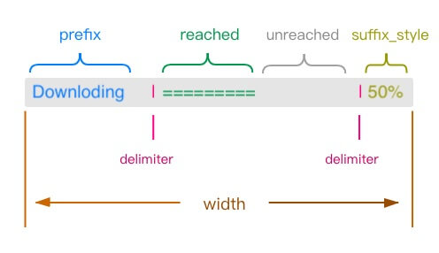

# progress
loading and progress bar


* [Progress](#Progress)
* [Loading](#Loading)

## Progress

### usage

```python
import time
from terminal_layout.extensions.progress import *

p = Progress('Downloading', 20)
p.start()
p.set_progress(2)
time.sleep(0.3)
for i in range(10):
    if p.is_finished():
        break
    time.sleep(0.3)
    p.add_progress(i - 1)
p.stop()
```

or use context manager
```python
import time
from terminal_layout.extensions.progress import *

with Progress('Downloading', 20) as p:
    p.set_progress(2)
    time.sleep(0.3)
    for i in range(10):
        if p.is_finished():
            break
        time.sleep(0.3)
        p.add_progress(i)
```

The result will be a bar like the following:

```
Downloading |███████████████████████████████                      |  60%
```

## parameter
There are several parameter you can set:



| name          | default              | desc                                         |
|---------------|----------------------|----------------------------------------------|
| prefix        |                      | prefix string                                |
| max           |                      | maximum value                                |
| delimiter     | `[" \|","\| "]`      | delimiter list                               |
| reached       | '█'(on linux); '='(on windows)   |                                  |
| unreached     | ''                   |                                              |
| suffix\_style | SuffixStyle\.percent | SuffixStyle class variable                   |
| width         | ProgressWidth\.half  | a int number or ProgressWidth class variable |

recommend for the collocation of reached and unreached  
推荐的reached, unreached组合  

| reached | unreached |
|---------|-----------|
|   █     |           |
|   =     |           |
|   █     |     ∙     |
|   =     |     .     |
|   ▓     |     ░     |

> some special characters (█, ░) won't display correctly on Windows.  
> 一些特殊字符（如：█, ░）在 Windows可能无法正确显示。
> 具体表现为在多行显示progress

## Loading

### usage

```python
import time
from terminal_layout.extensions.progress import *

l = Loading('loading', 20)
l.start()
l.set_progress(1)
for i in range(10):
    if l.is_finished():
        break
    time.sleep(0.3)
    l.add_progress(i)
l.stop()
```

or use context manager
```python
import time
from terminal_layout.extensions.progress import *

with Loading('loading', 20) as l:
    for i in range(10):
        if l.is_finished():
            break
        time.sleep(0.3)
        l.add_progress(i)
```

The result will be a bar like the following:

```
loading ⣟ 70%
```

## parameter
There are several parameter you can set:


| name          | default              | desc                                            |
|---------------|----------------------|-------------------------------------------------|
| prefix        |                      | prefix string                                   |
| max           |                      | maximum value                                   |
| refresh\_time | 0\.2                 | refresh time                                 |
| delimiter     | `[" "," "]`          | delimiter list                                  |
| infix         | InfixChoices\.style7 | a list of string or InfixChoices class variable |
| suffix\_style | SuffixStyle\.percent | SuffixStyle class variable                      |